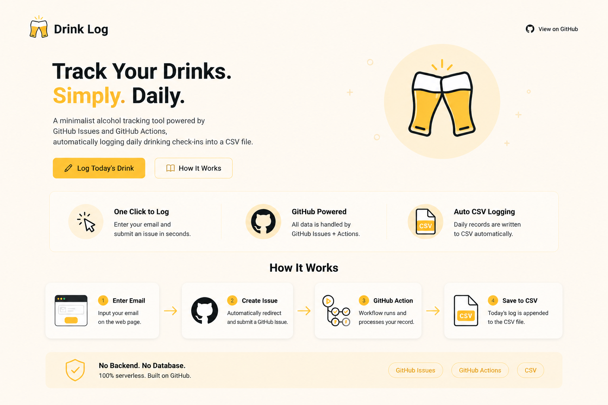

# Drink Log (Two-Step, No Backend)

A tiny two-step drink logging page with zero backend.

## How It Works

1. Open your GitHub Pages site.
2. Enter your email and click `Open Step 2`.
3. On GitHub, click `Submit new issue` once.
4. GitHub Action appends data to `data/drink-log.csv`.

## Why It Is Two-Step

This is a pure frontend page (no backend auth).  
So issue submission must be confirmed by the user on GitHub.

## Security Guardrail

The workflow only processes `drink-log` issues created by the repository owner.
Submissions from other users will not be written into your CSV.

## Required Files In The Repo

- `.github/workflows/process-drink-log.yml`
- `scripts/process_issue.py`
- `data/drink-log.csv`

If your repo was created from this template, they already exist.
